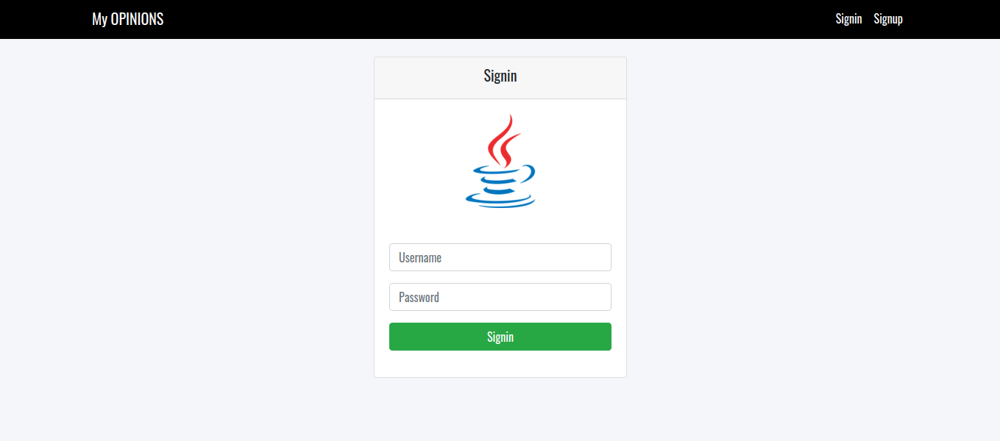
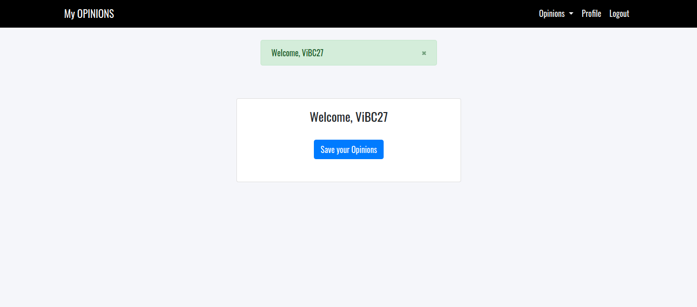
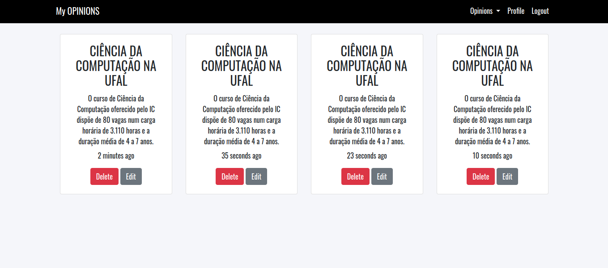

### Identificação

* Discente:
	* Nome: Vitor Barcelos de Cerqueira
	* Matrícula: 18110271 

### Cenário geral do software
Bem vindo! O software, basicamente, consiste em permitir ao usuário armazenar e gerenciar notas, onde esse esse mesmo usuário pode realizar a adição, a atualização e a remoção dessas notas. Essas notas na aplicação também são chamadas de opiniões do usuário. Alguns recursos incluídos são: sistema básico de autenticação com criptografia; adição de notas; remoção de notas; atualização de notas; página Profile; página Home; página Opiniões; etc

Nesse “software” foram realizados testes de unidade usando a técnica de teste funcional. Além disso, a ferramenta que foi utilizada é o “Jest JS”. Essa ferramenta é uma estrutura de teste para Javascript bastante difundida entre os desenvolvedores, sendo alguns dos seus pontos fortes: a sua documentação e a sua simplicidade. Os casos de teste estão contidos em um arquivo separado nesse ambiente de trabalho. Para vê-los basta abrir o arquivo 'Casos de Teste'. Eles foram executados de modo sucedido, sendo os resultados apresentados de modo detalhado no arquivo Relatório de Teste nesse ambiente de trabalho. A técnica e a ferramenta usada foram de extrema importância para a obtenção desses resultados satisfatórios. Se houvesse mais tempo, um próximo passo interessante será realizar mais testes usando a mesma técnica e melhorar o “software” criando mais funcionalidades.

Tecnologias usadas:

* Typescript;
* Express Js;
* Handlebars;
* Bcrypt Js;
* Node Js;
* Mysql;
* etc.

### Manual

1. Instalar Node JS, Yarn/Npm e Mysql;
2. Criar uma database chamada 'opinions';
3. Rodar yarn/npm migrate:do
4. Rodar yarn/npm seed:do
5. Rodar yarn/npm install;
6. Rodar yarn/npm run dev.

### Imagens

### Motivação

Esse projeto foi motivado pelo professor Willy Carvalho Tiengo da disciplina Teste de Software do curso de Ciência da Computação — UFAL(Universidade Federal de Alagoas).
